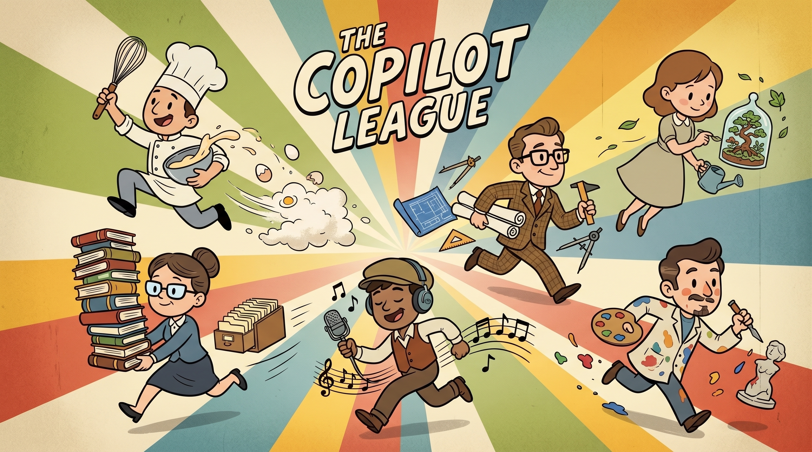
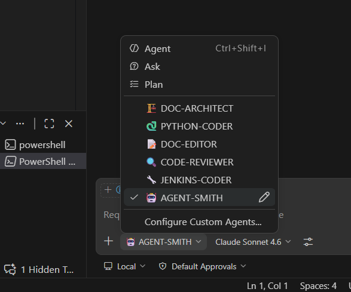

# Copilot League



## *Not all heroes wear capes. Some just know the rules.*

Copilot League is a self-maintaining library of **VS Code GitHub Copilot** agents. Each agent is a specialised mode: a domain expert that enforces a specific standard (code style, pipeline structure, documentation clarity). The library stays coherent because every agent was authored and is maintained to the same foundational standard: the one defined by AGENT-SMITH.

This library targets VS Code GitHub Copilot only. We do not ship Cursor rules, skills, or hooks.

## What You'll Learn

**Getting Started:**
- [What's Included](#whats-included) - Agents, personas, and instructions shipped with this library
- [Adding to a Project](#adding-to-a-project) - One-time corp copy, add as a `.github/` submodule
- [Task Repo Workflow](#task-repo-workflow) - Run and edit agents from a project that holds the work

**How It Works:**
- [Personas](#personas) - Behavioural blueprints that govern how agents confirm intent and resolve forks
- [How the Library Stays Consistent](#how-the-library-stays-consistent) - The four standards every agent is built and maintained to

## 📋 What's Included

Paths below are as seen from a **consuming project** after this library is the `.github` submodule. In this library's own repo, drop the `.github/` prefix (`agents/`, `instructions/`, `agent-tools/`).

**Agents** (`.github/agents/`) — each built and maintained to AGENT-SMITH's standards:

| Agent | What it does |
|---|---|
| 🤖 AGENT-SMITH | Creates and maintains agent definition files |
| ⚡ COPILOT-CLI-SPECIALIST | Designs Copilot CLI invocations, agent files, and plugin configs |
| 📓 COPILOT-SESSION-SCRIBE | Captures live session findings into `tmp/scribe/` docs in PR-CHRONICLER-ready format |
| 🏗️ DOC-ARCHITECT | Structures documentation for cognition — hierarchy, narrative, disclosure |
| 📝 DOC-EDITOR | Removes fluff from technical docs while preserving rationale |
| 🔀 GIT-SPECIALIST | Diagnoses branch state and executes branch, commit, merge, and push workflows safely |
| 🐹 GOLANG-CODER | Enforces safe, formatted, idiomatic Go |
| 🔧 JENKINS-CODER | Builds Jenkins pipelines following dispatcher pattern and enterprise standards |
| 📜 PR-CHRONICLER | Produces a dated evidence chronicle for a branch/PR from git and workspace artefacts |
| 🐍 PYTHON-CODER | Enforces type hints, formatting, linting compliance, and code review |

Once the submodule is at `.github/`, **VS Code GitHub Copilot** loads:

- Agents: `.github/agents/*.agent.md` in the chat agent picker
- Instructions: `.github/instructions/*.instructions.md` via `applyTo` (workspace-wide when `applyTo: "**"`)

GitHub Copilot CLI uses the same `.github/agents/` files when run from the repo. That is still GitHub Copilot, not a second IDE.



**Instructions** (`.github/instructions/`) — `*.instructions.md` files with `applyTo` frontmatter. Workspace-wide rules use `applyTo: "**"` (for example `copilot.instructions.md`, `neurodivergent.instructions.md`).

**Personas** (`.github/agents/personas/`) — behavioural blueprints referenced by the agents.

## 📦 Adding to a Project

We add this library as a **git submodule** at `.github/`. VS Code GitHub Copilot reads agents and instructions from that path.

Clone this repo, push it to corporate git **once**, then add that corp URL as a submodule in each project. Do not clone GitHub into `.github/` and gitignore it.

### Corporate Git Copy

Run this once per organisation. After the push, the corp copy is **self-managed**. The org fills `environment.md`, evolves agents, and never needs to pull GitHub again. We do not document an upstream-sync workflow.

Replace the corp URL with your internal git host (`AGENTS_GIT_URL` in `agents/references/environment.md`).

```bash
git clone https://github.com/behaviorengineering/copilot-league.git copilot-league
cd copilot-league
git remote remove origin
git remote add origin <AGENTS_GIT_URL>
git push -u origin --all
git push origin --tags
```

On the corp copy, set `REGISTRY_VENDOR` to `artifactory` or `nexus` in `agents/references/environment.md` and fill every Value cell. Commit those values on the corp copy so every project inherits them.

### Project Submodule

`.github` must not already exist. From the consuming project root:

```bash
git submodule add <AGENTS_GIT_URL> .github
git commit -m "Add copilot-league as .github submodule"
```

VS Code GitHub Copilot picks up agents and instructions automatically.

Later clones of the project need the submodule checked out:

```bash
git clone --recurse-submodules <project-url>
```

If the clone already exists:

```bash
git submodule update --init --recursive
```

### Submodule Updates

Run the manager from the project root:

```bash
python .github/scripts/submodule.py
```

It pulls or switches the library branch and commits the parent pointer.

## 🛠️ Task Repo Workflow

We run these agents from a **task repo**: a consuming project that already has this library as the `.github` submodule. The workspace holds the work (application code, Jenkinsfiles, docs). VS Code GitHub Copilot loads agents and `applyTo` instructions from that project's `.github/`.

The library is **self-maintaining**, but self-edits work from the task repo, not from this repo opened alone. AGENT-SMITH and DOC-EDITOR change files under `.github/agents/` in the submodule working tree. Commit those changes in the submodule, then push the corp copy (or run `python .github/scripts/submodule.py`).

We do not open this library as the only workspace when we want these agents in the picker. Paths and instructions resolve against the project root.

### Evals repo

The same layout is the eval harness. An **evals repo** is a task repo whose work is fixtures: cases PYTHON-CODER, JENKINS-CODER, and the rest must pass or fail.

Add this library as `.github`, run the matching agent against each fixture, and score whether it applied its constraints. We do not ship that evals repo here.

## 🎭 Personas

Personas govern how agents behave before and during execution. Two personas ship with this library:

**Intent-First** — agent states its read of the goal and asks "Does this match what you have in mind?" before touching anything.

**Consultant** — when execution reaches a fork with meaningful trade-offs, agent proposes options and waits for a decision.

Most agents compose both: Intent-First confirms the goal, Consultant resolves approach forks mid-execution.

## ⚙️ How the Library Stays Consistent

AGENT-SMITH is the meta-agent that defines the generic workflow, constraint language, and verification standards every other agent is held to. Every agent in this library was built by AGENT-SMITH, and any new agent goes through it before being added.

Four standards apply to every agent:

**Confirm intent before acting.** Every agent uses the Intent-First workflow: state your read of the goal, wait for explicit confirmation before touching anything.

**Constraint language.** Requirements use MUST/NEVER/ALWAYS, not "should" or "consider". Agents issue commands, not suggestions.

**Binary verification.** Every checklist item has a TRUE/FALSE outcome with a concrete verification method. No subjective "looks good": every check either passes or it does not.

**Executable examples.** Every constraint pairs a CORRECT and PROHIBITED implementation. No requirement ships without a template the AI can act on directly.
